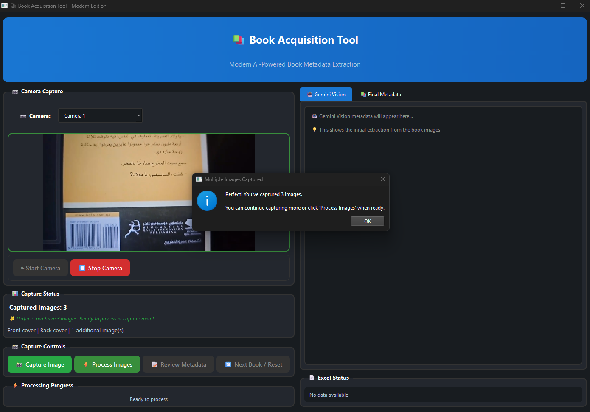
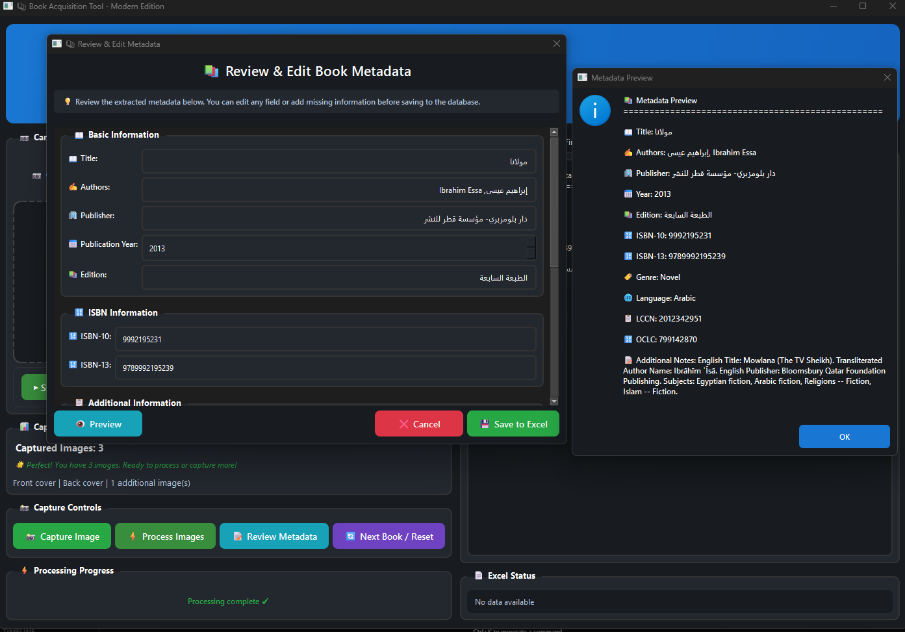

# 📚 Book Acquisitions Automation Tool

A modern, AI-powered desktop application for automating book metadata extraction and cataloging using computer vision, Gemini AI, and multiple book databases.

## 🌟 Features

- **📷 Multi-Image Capture**: Capture front cover, back cover, and additional pages for comprehensive metadata extraction
- **🤖 AI-Powered OCR**: Uses Google Gemini Vision API for intelligent text and metadata extraction from book images
- **🔍 Multi-Source Lookup**: Integrates with Google Books, OpenLibrary, Library of Congress, and ISBNlib APIs
- **📊 Smart Duplicate Detection**: Fuzzy matching algorithm to prevent duplicate book entries
- **📄 Excel Integration**: Saves book records to Excel files with standardized AUC cataloging format
- **⚡ Background Processing**: Non-blocking image processing with progress indicators
- **🔄 Batch Processing**: Process multiple books efficiently with reset functionality

## 🖼️ Screenshots

### Main Application Interface

*The main application window showing camera capture, processing controls, and metadata display tabs*

### Camera Capture

*Camera interface with live preview and capture controls*

### Multiple Images Upload

*Interface showing multiple book images uploaded (front cover, back cover, additional pages) ready for processing*

### Processing State

*Application state when all images are captured and are being processed*

### Metadata Review Dialog

*Interactive dialog for reviewing and editing extracted metadata before saving*

### Success Confirmation

*Success message and confirmation when book metadata is successfully saved to Excel file*

### Duplicate Detection

*Interface showing duplicate detection results when a book already exists in the database*

## 🚀 Quick Start

### Prerequisites

- **Python 3.8+** (3.9+ recommended)
- **Windows 10/11** (primary platform, other platforms may work)
- **Webcam/Camera** for book image capture
- **Internet Connection** for API access

### Required API Keys

1. **Google Gemini API Key** - [Get it here](https://makersuite.google.com/app/apikey)
2. **Google Books API Key** - [Get it here](https://developers.google.com/books/docs/v1/getting_started)

### Installation

1. **Clone the repository**
   ```bash
   git clone https://github.com/yourusername/book-acquisitions-automation.git
   cd book-acquisitions-automation
   ```

2. **Create and activate virtual environment**
   ```bash
   python -m venv venv
   
   # Windows
   venv\Scripts\activate
   
   # macOS/Linux
   source venv/bin/activate
   ```

3. **Install dependencies**
   ```bash
   pip install -r requirements.txt
   ```

4. **Set up environment variables**
   
   Create a `.env` file in the project root:
   ```env
   GEMINI_API_KEY=your_gemini_api_key_here
   GOOGLE_BOOKS_API_KEY=your_google_books_api_key_here
   ```

5. **Run the application**
   ```bash
   python src/UI/Desktop_App.py
   ```

## 🏗️ Project Structure

```
book-acquisitions-automation/
├── 📁 src/
│   ├── 📁 UI/
│   │   └── 🖥️ Desktop_App.py            # Main application
│   ├── 📁 vision/
│   │   └── 🤖 gemini_processing.py      # AI image processing
│   ├── 📁 metadata/
│   │   └── 🔗 llm_metadata_combiner.py  # Metadata merging
│   ├── 📁 utils/
│   │   ├── 📚 google_books.py           # Google Books API
│   │   ├── 📖 openlibrary.py            # OpenLibrary API
│   │   ├── 🏛️ LOC.py                    # Library of Congress API
│   │   └── 🔢 isbnlib_service.py        # ISBN lookup service
├── 📁 config/
│   └── ⚙️ config.py                     # Configuration management
├── 📁 database/                         # Excel files storage
├── 📁 data/
│   ├── 📁 raw_images/                   # Captured book images
│   ├── 📁 processed/                    # Processed images
│   └── 📁 metadata/                     # Extracted metadata
├── 📁 venv/                             # Python virtual environment
├── 📄 requirements.txt                  # Python dependencies
└── 📖 README.md                         # This file
```

## 🎯 How It Works

### 1. Image Capture Process
- **Camera Setup**: Select and start your camera
- **Multi-Image Capture**: Capture front cover, back cover, and additional pages
- **Image Validation**: Ensure sufficient image quality for processing

### 2. AI Processing Pipeline
- **Gemini Vision Analysis**: AI extracts text and metadata from images
- **ISBN Detection**: Identifies ISBN numbers from back covers
- **External API Queries**: Enriches data from multiple book databases
- **Metadata Merging**: Combines all sources into unified record

### 3. Data Management
- **Duplicate Detection**: Fuzzy matching prevents duplicate entries
- **Excel Export**: Saves to standardized AUC cataloging format
- **Data Validation**: Ensures data quality and completeness

## 📋 Usage Guide

### Step-by-Step Workflow

#### 1. Launch Application
- Run `python src/UI/Desktop_App.py`
- Application starts with camera preview area

#### 2. Camera Setup
- Select your camera from the dropdown
- Click "▶ Start Camera" to begin live preview
- Ensure good lighting for book images

#### 3. Book Processing
- **Capture Front Cover**: Position book front cover and click "📸 Capture Image"
- **Capture Back Cover**: Flip book and capture back cover for ISBN
- **Additional Images**: Capture any pages with additional text if needed
- **Process Images**: Click "⚡ Process Images" to begin AI analysis

#### 4. Review and Edit
- **Review Metadata**: Check extracted information in the tabs
- **Edit Fields**: Use "📝 Review Metadata" button to modify data
- **Preview Changes**: Review final metadata before saving

#### 5. Save to Excel
- **Duplicate Check**: System automatically checks for existing records
- **Save Record**: Click "💾 Save to Excel" to store the book
- **Next Book**: Use "🔄 Next Book / Reset" to process another book

### Excel Output Format

If book is not a duplicate, the application creates an Excel file with the following columns:

| Column | Description | Example |
|--------|-------------|---------|
| **TITLE** | Book title | "To Kill a Mockingbird" |
| **AUTHOR** | Author(s) name(s) | "Harper Lee" |
| **PUBLISHED** | Publisher and year | "Harper Perennial: 2006" |
| **D.O. Pub.** | Publication year only | "2006" |
| **OCLC no.** | OCLC number | "123456789" |
| **LC no.** | Library of Congress number | "2005001234" |
| **ISBN** | ISBN (cleaned) | "9780061120084" |
| **AUC no.** | Auto-generated catalog number | "b0000001x" |

## ⚙️ Configuration

### Environment Variables

Create a `.env` file in your project root:

```env
# Required API Keys
GEMINI_API_KEY=your_gemini_api_key_here
GOOGLE_BOOKS_API_KEY=your_google_books_api_key_here

# Optional Settings
REQUEST_DELAY=3
MAX_RETRIES=3
TIMEOUT=15
```

### API Key Setup

#### Google Gemini API
1. Visit [Google AI Studio](https://makersuite.google.com/app/apikey)
2. Create a new API key
3. Copy the key to your `.env` file

#### Google Books API
1. Go to [Google Cloud Console](https://console.cloud.google.com/)
2. Enable the Books API
3. Create credentials (API key)
4. Add the key to your `.env` file

## 🔧 Troubleshooting

### Common Issues

#### Camera Not Working
- **Problem**: Camera fails to start or shows black screen
- **Solution**: 
  - Check if camera is used by another application
  - Try different camera backends (DirectShow, MSMF)
  - Restart the application

#### API Errors
- **Problem**: "API key not found" or connection errors
- **Solution**:
  - Verify `.env` file exists and has correct API keys
  - Check internet connection
  - Ensure API keys are valid and have proper permissions

#### Excel Permission Errors
- **Problem**: "Permission denied" when saving to Excel
- **Solution**:
  - Close any open Excel files
  - Ensure the database folder is writable
  - Check if file is locked by another process

#### Image Processing Failures
- **Problem**: Images fail to process or return no metadata
- **Solution**:
  - Ensure good lighting and clear image focus
  - Check if book text is readable in the image
  - Verify Gemini API key is valid and has quota remaining

### Performance Optimization

- **Image Quality**: Use good lighting and clear focus for best results
- **Batch Processing**: Process multiple books in one session
- **API Limits**: Respect rate limits to avoid API blocks


## 📚 Dependencies

### Core Dependencies
- **PyQt6**: Modern GUI framework
- **OpenCV**: Computer vision and camera handling
- **Pandas**: Data manipulation and Excel export
- **Google Generative AI**: Gemini Vision API integration

### API Dependencies
- **Google Books API**: Book metadata lookup
- **OpenLibrary API**: Additional book information
- **Library of Congress API**: LCCN lookup
- **ISBNlib**: ISBN validation and metadata

### Development Dependencies
- **Python 3.8+**: Runtime environment
- **pip**: Package management
- **virtualenv**: Environment isolation


## 📄 License

This project is licensed under the MIT License - see the [LICENSE](LICENSE) file for details.

## 🙏 Acknowledgments

- **Google Gemini AI** for advanced image analysis capabilities
- **OpenLibrary** for comprehensive book metadata
- **Google Books** for extra book metadata
- **Library of Congress** for authoritative cataloging data
- **PyQt6** for the modern desktop interface framework

## 📞 Support

### Getting Help
- **Issues**: Report bugs via GitHub Issues
- **Discussions**: Ask questions in GitHub Discussions
- **Documentation**: Check this README and code comments
---

## 📊 Project Status

- **Version**: 2.0.0
- **Last Updated**: 4/9/2025
- **Python Compatibility**: 3.8+
- **Platform Support**: Windows (primary), macOS, Linux
- **Development Status**: Active Development

---
